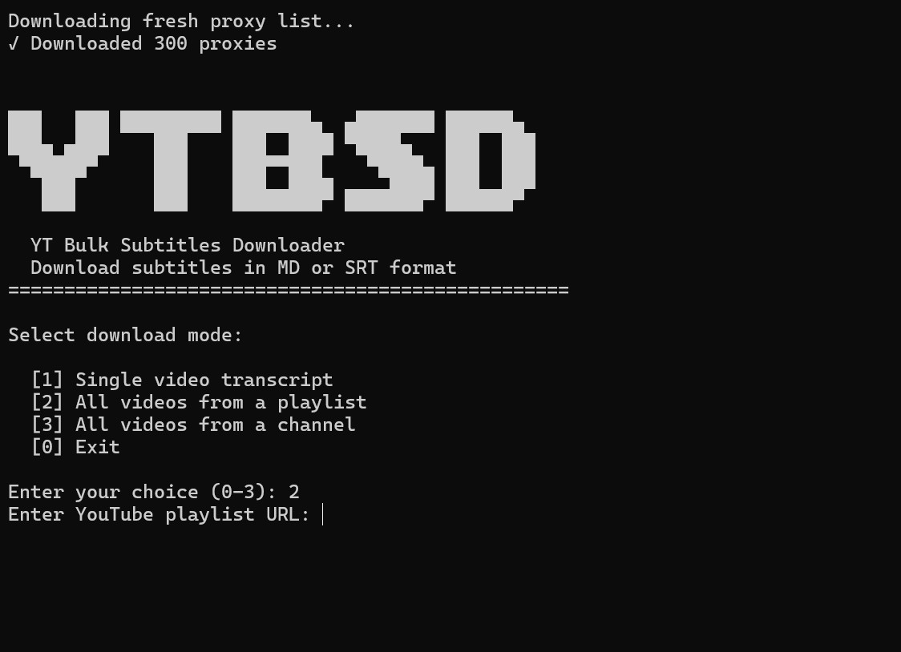

# YouTube Bulk Subtitles Downloader (YTBSD)

A high-performance CLI tool for mass downloading subtitles (captions) from YouTube channels, playlists, or individual videos.

## Features

- **Bulk Download** - Download thousands of subtitles from entire YouTube channels or playlists
- **Multiple Output Formats** - Save as Markdown (ideal for NotebookLM and LLM RAG applications) or SRT with timestamps
- **High-Speed Multi-threading** - Supports up to 1000 parallel workers for fast downloads
- **Proxy Rotation** - Automatically fetches ~300 free proxies on each run to prevent rate limiting
- **Smart Anti-Blocking** - Collaborative multi-proxy pattern with automatic proxy refresh (up to 3 cycles)
- **Resume Capability** - Progress is saved automatically; interrupted downloads can be resumed
- **Cross-Platform** - Works on Windows, Linux, and macOS

## Installation

### Option 1: From Source

1. Clone or download this repository
2. Run `setup.bat` (Windows) to create a virtual environment and install dependencies
3. Run `start.bat` to launch the tool

### Option 2: Windows Executable

Download the pre-compiled executable from the [Releases](https://github.com/roundyyy/yt-bulk-subtitles-downloader/releases/download/0.2/ytbsd.exe) page.
No Python installation required. Place the exe in any folder on your PC and run it. The `subtitles` folder and `proxies.txt` file will be created automatically in the same location as the exe.

## Requirements

- Python 3.8 or newer
- Google Chrome (for proxy fetching via Selenium)

## Usage

1. Launch the tool using `start.bat`
2. Select download mode:
   - Single video
   - Playlist
   - Channel (videos, shorts, or both)
3. Enter the YouTube URL
4. Configure thread count and output format
5. Wait for download to complete

Output files are saved to the `subtitles` folder.

## Output Formats

| Format | Description |
|--------|-------------|
| Markdown (.md) | All transcripts in a single file with table of contents. Optimized for LLM RAG and NotebookLM. |
| SRT (.srt) | Individual subtitle files per video with timestamps. Standard subtitle format. |

## Disclaimer

This tool is intended for educational purposes only.

## Acknowledgments

- [yt-dlp](https://github.com/yt-dlp/yt-dlp) - Video metadata extraction
- [youtube-transcript-api](https://github.com/jdepoix/youtube-transcript-api) - Transcript fetching

## License

MIT License

